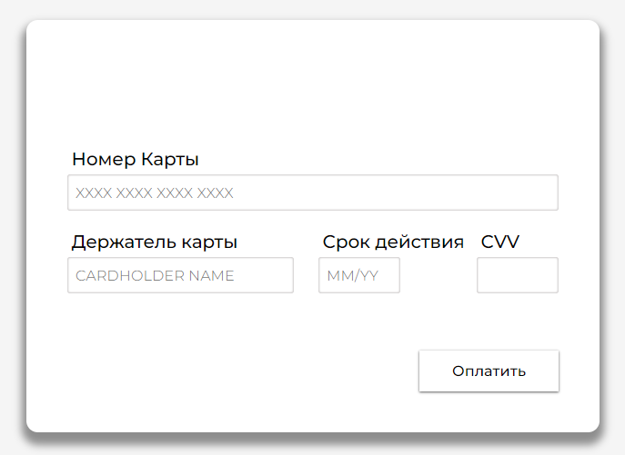
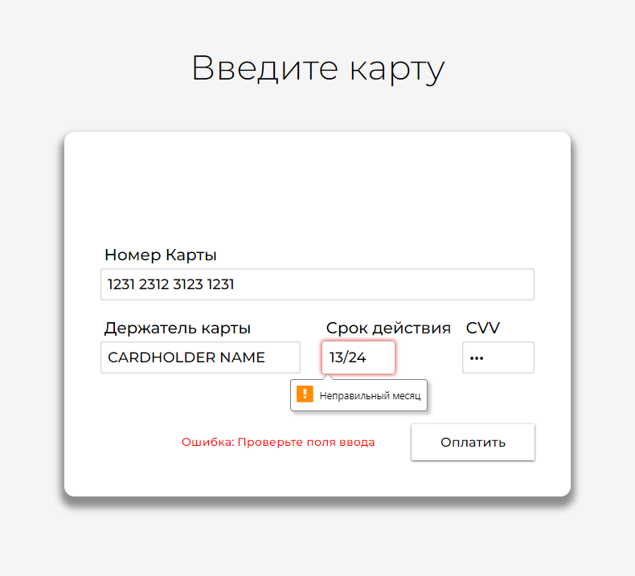
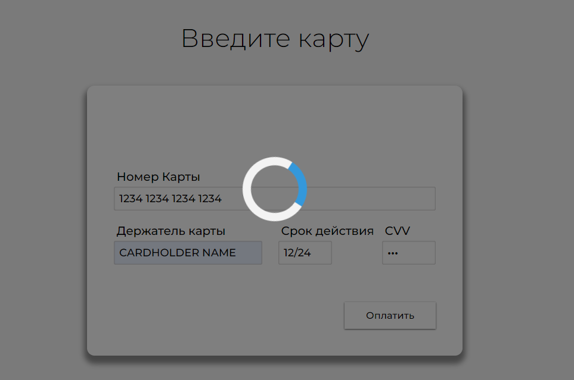
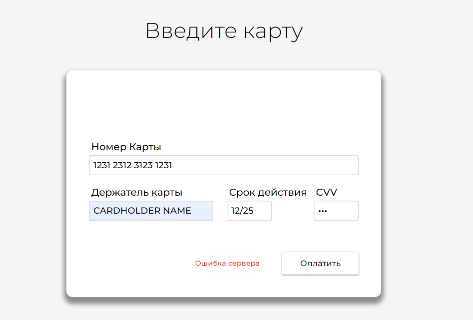

# Credit Card Form Project

This project is a practice implementation of a credit card submission form. It allows users to enter their card details and submit the form, simulating a payment process. The project was developed to practice and demonstrate proficiency in front-end development technologies.

## Features

- Responsive credit card form
- Input formatting and validation for card number, cardholder name, expiration date, and CVV
- Dynamic card logo change based on card number input
- Simulated server request for form submission
- Loading and success animations

## Try it out
https://mdayzz.github.io/credit-card-form/

## Technologies and Tools Used

- **HTML5**: For structuring the content
- **CSS3**: For styling the form and adding animations
- **JavaScript (ES6)**: For handling form validation, animations, and simulated server interaction
- **Font-Face**: For custom fonts

## Installation

1. Clone the repository:
   ```bash
   git clone https://github.com/mDayZZ/credit-card-form.git
   ```
2. Navigate to the project directory:
   ```bash
   cd credit-card-form
   ```
3. Open `index.html` in your browser to view the form.

## Usage

- Enter a card number, cardholder name, expiration date, and CVV.
- The card logo will change dynamically based on the card number (supports Visa, MasterCard, and Mir).
- Click the "Оплатить" button to submit the form.
- If the input is valid, a loading animation will be displayed followed by a success animation.
- If there are any errors, an error message will be shown.

## Project Structure

- `index.html`: Contains the HTML structure of the form.
- `style.css`: Contains the CSS styles and animations.
- `main.js`: Contains the JavaScript code for form validation, dynamic logo change, and simulated server interaction.
- `images/`: Contains the card logos and any other image assets.
- `fonts/`: Contains the custom fonts used in the project.

## Key Concepts Practiced

- **Form Validation**: Ensuring that the user inputs valid data before submission.
- **Dynamic Content Update**: Changing the card logo based on the card number input.
- **Animations**: Adding animations for the loading and success states.
- **Simulated Server Interaction**: Using `Promise` to simulate server interaction with a fake fetch function.

## Preview


## Screenshots







## Contact

If you have any questions or feedback, feel free to contact me at [maxdayzzoff@gmail.com](mailto:maxdayzzoff@gmail.com)

---
